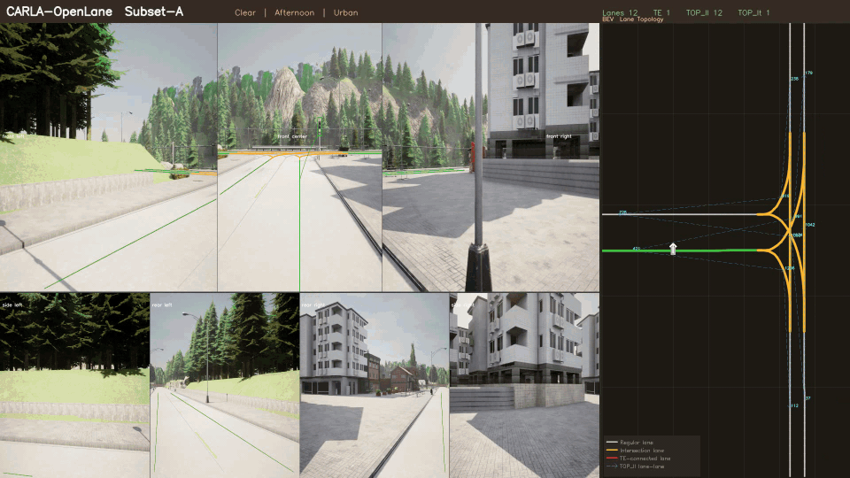
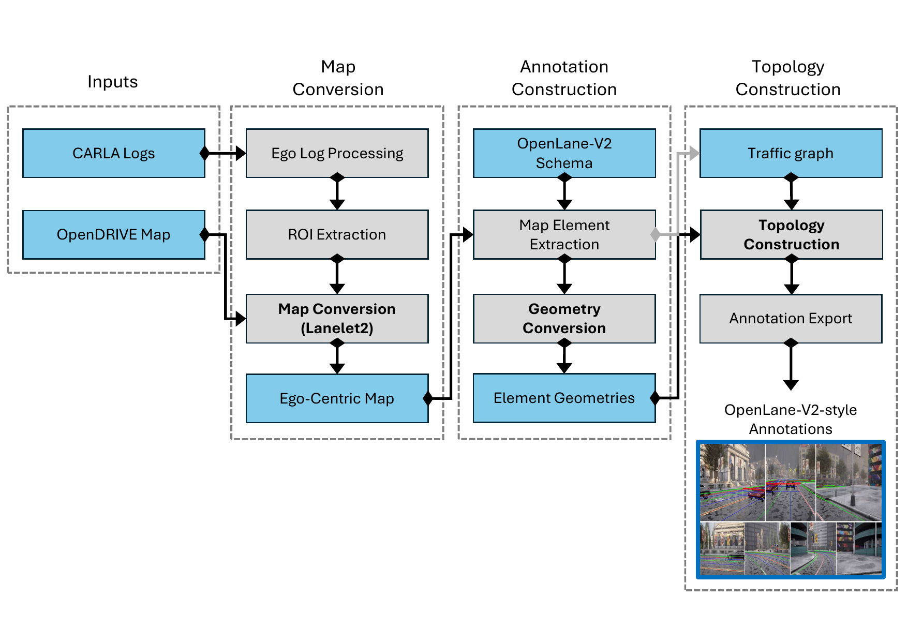

# CARLA-OpenLane

> **A large-scale synthetic dataset for lane topology reasoning, generated with CARLA simulator and annotated in OpenLane-V2 format.**

[](https://opensource.org/licenses/MIT)
[](https://carla.org/)
[](https://github.com/OpenDriveLab/OpenLane-V2)

---

## Dataset



| Subset | Scenes | Frames | Camera Setup | Format |
|--------|--------|--------|--------------|--------|
| **A** | 790 (729 train / 61 val) | ~15,800 | ArgoVerse2 (7 cams, 2048×1550) | OpenLane-V2 |
| **B** | 634 (498 train / 136 val) | ~12,680 | nuScenes (6 cams, 1600×900) | OpenLane-V2 |

Covers 7 CARLA towns (Town01/03/04/05/06/07/10) across diverse weather and time-of-day conditions.

**Download:** Dataset will be available upon paper acceptance.
- Subset A (~36 GB): [Google Drive](https://drive.google.com/file/d/YOUR_SUBSET_A_LINK) (will be available soon)
- Subset B (~32 GB): [Google Drive](https://drive.google.com/file/d/YOUR_SUBSET_B_LINK)(will be available soon)

---

## Results

Validation results on OpenLane-V2 (with vs. without CARLA-OpenLane pre-training).

**Subset A — LaneSegNet (lane segment, OLUS)**

| Method | DET_ℓ | DET_t | DET_a | TOP_ℓℓ | TOP_ℓt | OLUS |
|--------|-------|-------|-------|--------|--------|------|
| LaneSegNet · Real-only | 30.3 | 24.9 | 20.1 | 25.3 | 18.0 | 33.6 |
| LaneSegNet · w/ CARLA-OpenLane | **32.7** | **35.3** | **23.1** | **28.0** | **21.8** | **38.2** |

**Subset B — TopoNet & TopoLogic (centerline, OLS)**

| Method | DET_ℓ | DET_t | TOP_ℓℓ | TOP_ℓt | OLS |
|--------|-------|-------|--------|--------|-----|
| TopoNet · Real-only | 20.9 | 45.2 | 4.2 | 11.5 | 30.1 |
| TopoNet · w/ CARLA-OpenLane | **27.5** | **51.6** | **10.6** | **17.8** | **38.5** |
| TopoLogic · Real-only | 23.4 | 42.9 | 19.1 | 14.0 | 36.9 |
| TopoLogic · w/ CARLA-OpenLane | **27.5** | **56.1** | **24.0** | **18.2** | **43.8** |

---

## Data Generation

Requires CARLA 0.9.15 and the `carla` conda environment.

```bash
cd Carla/

# Run all towns with default settings
./run.sh

# Run specific towns
./run.sh Town01 Town03 Town05
# or
TOWNS="1,3,5,7,10" ./run.sh
```

**Single-script capture:**
```bash
# Subset A — ArgoVerse2 (7 cameras)
python data_capture_Argoverse2.py --scene 15 --sample 10 --spawn-offset 0 \
  --traffic-level 1 --weather ClearNoon --dir train --pose-format openlanev2

# Subset B — nuScenes (6 cameras)
python data_capture_nuScenes.py --scene 15 --sample 10 --spawn-offset 0 \
  --traffic-level 1 --weather ClearNoon --dir train --pose-format openlanev2
```

| Argument | Options | Description |
|----------|---------|-------------|
| `--scene` | int | Scenes per cycle (default: 15) |
| `--sample` | int | Waypoints per scene (default: 10) |
| `--traffic-level` | 1, 2 | Low / high traffic density |
| `--weather` | 17 presets | e.g. `ClearNoon`, `HardRainSunset` |
| `--dir` | `train`, `val` | Output split |
| `--pose-format` | `openlanev2`, `carla-matrix`, `carla-rpy` | Pose encoding |

---

## Annotation

Converts raw CARLA data (images + JSON metadata + OpenDRIVE maps) into OpenLane-V2 format using the **OpenLane-V2-HDmap-Converter** tool.

**Downloads:**
- Annotation tool: [OpenLane-V2-HDmap-Converter-v1.0.zip](https://github.com/haunjo/Carla-OpenLane/releases/download/v1.0/OpenLane-V2-HDmap-Converter-v1.0.zip)
- Docker image (~15 GB): [Google Drive](https://drive.google.com/file/d/1xnnxYKHkksZQpLdBWJCJDwgFpAgrlkv1/view?usp=drive_link)

```bash
# 1. Unzip annotation tool
unzip OpenLane-V2-HDmap-Converter-v1.0.zip -d OpenLane-V2-HDmap-Converter

# 2. Load Docker image
docker load < lanelet2.tar.gz

# 3. Launch container
bash OpenLane-V2-HDmap-Converter/docker/run_docker.sh \
  --dataset /path/to/Carla-OpenLane

# Inside container: run annotation
python3 src/carla2openlanev2.py --split train
python3 src/carla2openlanev2.py --split val

# Validate
python3 src/checksum.py --root Carla-OpenLane/train
```



---

## Training

Clone each baseline into the corresponding subdirectory:

```bash
git clone https://github.com/OpenDriveLab/LaneSegNet.git   LaneSegNet
git clone https://github.com/Franpin/TopoLogic.git         TopoLogic
git clone https://github.com/OpenDriveLab/TopoNet.git      TopoNet
```

### LaneSegNet (Subset A)

Two-stage training: pre-train on CARLA-OpenLane, then fine-tune on OpenLane-V2.

```bash
cd LaneSegNet
pip install -r requirements.txt

# Stage 1 — CARLA-OpenLane pre-training (8 epochs, 2 GPUs)
CONFIG=projects/configs/lanesegnet_r50_1x2_8e_carla_subset_A_mapele_bucket_naive.py
./tools/dist_train.sh $CONFIG 2

# Stage 2 — OpenLane-V2 fine-tuning (24 epochs, 8 GPUs)
CONFIG=projects/configs/lanesegnet_r50_8x1_24e_olv2_subset_A.py
./tools/dist_train.sh $CONFIG 8

# Evaluation
./tools/dist_test.sh $CONFIG work_dirs/latest.pth 8
```

### TopoLogic (Subset A → Subset B)

```bash
cd TopoLogic
pip install -r requirements.txt

# Stage 1 — CARLA-OpenLane pre-training (12 epochs, 2 GPUs)
CONFIG=projects/configs/topologic_r50_1x2_12e_carla_subset_A.py
./tools/dist_train.sh $CONFIG 2

# Stage 2 — OpenLane-V2 fine-tuning, Subset B (24 epochs, 8 GPUs)
CONFIG=projects/configs/topologic_r50_8x1_24e_olv2_subset_B.py
./tools/dist_train.sh $CONFIG 8

# Evaluation
./tools/dist_test.sh $CONFIG work_dirs/latest.pth 8
```

### TopoNet (Subset B)

```bash
cd TopoNet
pip install -r requirements.txt

# OpenLane-V2 fine-tuning, Subset B (24 epochs, 8 GPUs)
CONFIG=projects/configs/toponet_r50_8x1_24e_olv2_subset_B.py
./tools/dist_train.sh $CONFIG 8

# Evaluation
./tools/dist_test.sh $CONFIG work_dirs/latest.pth 8
```

---

## Repository Structure

```
Carla-OpenLane/
├── Carla/                          # Data generation
│   ├── data_capture_Argoverse2.py  # Subset A capture (7 cameras)
│   ├── data_capture_nuScenes.py    # Subset B capture (6 cameras)
│   └── run.sh                      # Multi-town orchestration
├── datasets/
│   ├── splits/                     # Train/val split manifests
│   └── statistics/                 # Scene distribution stats
└── docs/
    ├── ANNOTATION.md               # Annotation tool guide
    ├── DATASET.md                  # Dataset format & specification
    └── FULL_WORKFLOW.md            # End-to-end pipeline guide

OpenLane-V2-HDmap-Converter/        # Downloaded separately (see Annotation)
├── src/
│   ├── carla2openlanev2.py         # Main converter
│   └── checksum.py                 # Integrity validation
└── docker/
    └── run_docker.sh               # Container launcher
```

---

## Related Projects

- [OpenLane-V2](https://github.com/OpenDriveLab/OpenLane-V2) — dataset format and evaluation
- [LaneSegNet](https://github.com/OpenDriveLab/LaneSegNet) — lane segment baseline
- [TopoLogic](https://github.com/Franpin/TopoLogic) — topology reasoning baseline
- [TopoNet](https://github.com/OpenDriveLab/TopoNet) — topology reasoning baseline
- [CARLA Simulator](https://carla.org/) — data generation platform

---

## License

MIT License — see [LICENSE](LICENSE).
