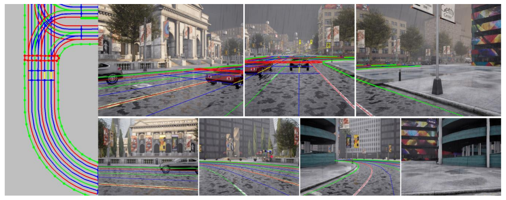
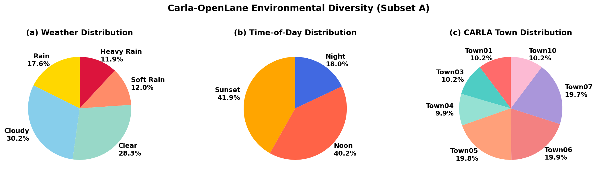

# Carla-OpenLane Dataset

> **A large-scale synthetic dataset for 3D lane topology detection, generated with CARLA simulator and annotated in OpenLane-V2 format.**

[](https://opensource.org/licenses/MIT)
[](https://carla.org/)
[](https://github.com/OpenDriveLab/OpenLane-V2)

---

## Overview

**Carla-OpenLane** provides:
- **Multi-camera synthetic data** compatible with ArgoVerse2 and nuScenes camera setups
- **HD map annotations** including lane segments, topology matrices, and traffic elements
- **Diverse scenarios** across 10 CARLA towns with varied weather and traffic conditions
- **Large-scale coverage** with up to 200 scenes and 6000+ frames per subset

**Use cases:**
- Train 3D lane detection models (LaneSegNet, TopoNet, etc.)
- Sim-to-real domain adaptation research
- HD mapping and autonomous driving perception

---

## Quick Start

### Prerequisites

- **Python:** 3.8+
- **PyTorch:** 1.9.1 (CUDA 11.1)
- **Storage:** 50GB+ for dataset + models

### Option 1: Use Pre-Annotated Dataset (Recommended)

```bash
# 1. Clone repository
git clone https://github.com/haunjo/Carla-OpenLane.git
cd Carla-OpenLane

# 2. Download dataset (Subset A: ArgoVerse2, 36GB)
./scripts/download_dataset.sh --subset A

# 3. Link dataset and preprocess annotations to PKL format
cd LaneSegNet
mkdir -p data
ln -s /path/to/Carla-OpenLane/data data/Carla-OpenLane
python tools/data_process.py

# 4. Train model (4 GPUs)
./tools/dist_train.sh 4
```

> Dataset download will be available upon paper acceptance. Contact the maintainer for early access.

### Option 2: Annotate Custom CARLA Data

```bash
# 1. Generate raw data with CARLA simulator (requires CARLA 0.9.15)
cd Carla
./run.sh
#    See docs/FULL_WORKFLOW.md for full data generation guide

# 2. Download annotation tool
./scripts/download_dataset.sh --converter-only
#    Then follow the Docker setup in OpenLane-V2-HDmap-Converter/docker/DOCKER_DISTRIBUTION.md

# 3. Preprocess and train
cd LaneSegNet
python tools/data_process.py
./tools/dist_train.sh 4
```

**Full workflow guide:** [docs/FULL_WORKFLOW.md](docs/FULL_WORKFLOW.md)

---

## Dataset



### Available Subsets

| Subset | Scenes | Frames | Cameras | Resolution | Format |
|--------|--------|--------|---------|------------|--------|
| **A (ArgoVerse2)** | 790 (729 train / 61 val) | ~15,800 | 7 | 2048×1550 (front) | Argoverse2 |
| **B (nuScenes)** | 634 (498 train / 136 val) | ~12,680 | 6 | 1600×900 | nuScenes |

> Dataset download will be available upon paper acceptance. Contact the maintainer for early access.

### Statistics (Subset A)

- **Avg lanes per frame:** 26.3
- **Avg traffic elements:** 3.2 (lights + signs)
- **Intersection frames:** 18.5%
- **Towns:** Town01, Town03, Town04, Town05, Town06, Town07, Town10



**Detailed specification:** [docs/DATASET.md](docs/DATASET.md)

---

## Repository Structure

```
Carla-OpenLane/
├── Carla/                          # CARLA data collection
│   ├── data_capture_Argoverse2.py  # 7-camera capture (Subset A)
│   ├── data_capture_nuScenes.py    # 6-camera capture (Subset B)
│   ├── run.sh                      # Orchestration (multi-town/weather)
│   ├── clean_carla.sh              # Kill CARLA processes
│   ├── openlane_v2_subset_A.json   # Annotation schema (Subset A)
│   ├── openlane_v2_subset_B.json   # Annotation schema (Subset B)
│   └── scripts/                    # HD map visualization tools
├── datasets/
│   ├── splits/                     # Train/val split manifests (tracked)
│   └── statistics/                 # Scene distribution stats (tracked)
├── docs/
│   ├── FULL_WORKFLOW.md            # End-to-end pipeline guide
│   ├── ANNOTATION.md               # Annotation tool usage
│   ├── DATASET.md                  # Dataset format and specification
│   └── RELEASE_GUIDE.md            # Maintainer release instructions
└── scripts/
    ├── download_dataset.sh         # Download dataset + annotation tool
    └── analyze_scene_distribution.py

OpenLane-V2-HDmap-Converter/        # Downloaded via download_dataset.sh
├── src/
│   ├── carla2openlanev2.py         # Main converter pipeline
│   ├── repair_lste.py              # Repair topology_lste annotations
│   └── checksum.py                 # Integrity validation
└── docker/
    ├── run_docker.sh               # Launch annotation container
    └── DOCKER_DISTRIBUTION.md     # Docker image setup guide
```

> **Baseline models** (LaneSegNet, TopoLogic, TopoNet) are not distributed here.
> Obtain them from their original repositories and place under `LaneSegNet/`, `TopoLogic/`, `TopoNet/`.

---

## Workflow

### Complete Pipeline

```
┌────────────────┐       ┌──────────────────┐       ┌─────────────────┐
│ CARLA Simulator│  →    │  Annotation Tool │  →    │  Model Training │
│  (Carla/)      │       │  (HDmap-Converter│       │  (LaneSegNet/)  │
└────────────────┘       └──────────────────┘       └─────────────────┘
     Optional                  Required                   Required
```

**Step-by-step guides:**
1. [Full Workflow](docs/FULL_WORKFLOW.md) - End-to-end pipeline
2. [Annotation](docs/ANNOTATION.md) - Convert CARLA data to OpenLane-V2 format
3. [Dataset](docs/DATASET.md) - Dataset format and specification

---

## Data Annotation

We use **OpenLane-V2-HDmap-Converter** to annotate raw CARLA data into OpenLane-V2 format.
The tool is distributed as a release asset (not a separate repo).

### Quick Annotation

```bash
# 1. Download annotation tool
./scripts/download_dataset.sh --converter-only

# 2. Set up Docker image (see OpenLane-V2-HDmap-Converter/docker/DOCKER_DISTRIBUTION.md)
docker pull haunjo/lanelet2:latest  # requires access — contact maintainer

# 3. Run annotation
bash OpenLane-V2-HDmap-Converter/docker/run_docker.sh --dataset /path/to/Carla-OpenLane
# Inside container:
python3 src/carla2openlanev2.py --split train
python3 src/carla2openlanev2.py --split val
```


**Annotation tool features:**
- Automatic map conversion (OpenDRIVE → Lanelet2)
- Lane segment extraction with camera visibility filtering
- Topology matrix generation (lane-to-lane, lane-to-traffic)
- Targeted repair of traffic element associations (`repair_lste.py`)

**Full guide:** [docs/ANNOTATION.md](docs/ANNOTATION.md)

---

## Model Training

### Supported Models

- **[LaneSegNet](https://github.com/OpenDriveLab/LaneSegNet)** — clone to `LaneSegNet/`
- **[TopoLogic](https://github.com/Franpin/TopoLogic)** — clone to `TopoLogic/`
- **[TopoNet](https://github.com/OpenDriveLab/TopoNet)** — clone to `TopoNet/`

### Training LaneSegNet

```bash
cd LaneSegNet

# Install dependencies
pip install -r requirements.txt

# Multi-GPU training (default config: olv2 subset A, 24 epochs)
./tools/dist_train.sh 4

# Training with CARLA config (8 epochs, for pre-training)
CONFIG=projects/configs/lanesegnet_r50_1x2_8e_carla_subset_A_mapele_bucket_naive.py \
  ./tools/dist_train.sh 4
```

The default config is hardcoded in `tools/dist_train.sh`. Edit the `CONFIG` variable to switch experiments.

### Evaluation

```bash
cd LaneSegNet

# Evaluate on validation set (uses latest checkpoint in work_dirs/)
./tools/dist_test.sh 4

# Evaluate with visualization
./tools/dist_test.sh 4 --show
```

See [LaneSegNet](https://github.com/OpenDriveLab/LaneSegNet) for detailed training documentation.

---

## Documentation

| Document | Description |
|----------|-------------|
| [FULL_WORKFLOW.md](docs/FULL_WORKFLOW.md) | Complete pipeline from data generation to training |
| [ANNOTATION.md](docs/ANNOTATION.md) | How to use OpenLane-V2-HDmap-Converter |
| [DATASET.md](docs/DATASET.md) | Dataset format, statistics, and download |
| [RELEASE_GUIDE.md](docs/RELEASE_GUIDE.md) | Maintainer guide for cutting releases |

---

## Performance Benchmarks

### Dataset Generation

- **Annotation speed:** 2-4 hours for 200 scenes (16-core CPU)
- **Storage:** ~180GB per 200-scene subset (raw + annotations)

### Model Training (LaneSegNet on Subset A)

| GPUs | Batch Size | Training Time | Val F1-Score |
|------|------------|---------------|--------------|
| 1× RTX 3090 | 2 | ~48 hours | 0.62 |
| 4× RTX 3090 | 16 (4 per GPU) | ~12 hours | 0.64 |

---

## Citation

If you use this dataset or code, please cite:

```bibtex
@misc{carla-openlane2025,
  title={Carla-OpenLane: A Synthetic Dataset for 3D Lane Topology Detection},
  author={Jo, Haun and others},
  year={2025},
  note={Paper under review},
  url={https://github.com/haunjo/Carla-OpenLane}
}

@inproceedings{openlanev2,
  title={OpenLane-V2: A Topology Reasoning Benchmark for Unified 3D HD Mapping},
  author={Wang, Huijie and Li, Yue and Chen, Yilun and others},
  booktitle={NeurIPS},
  year={2023}
}
```

---

## Related Projects

- **[OpenLane-V2](https://github.com/OpenDriveLab/OpenLane-V2)** - Original dataset and benchmark
- **[OpenLane-V2-HDmap-Converter](https://github.com/haunjo/OpenLane-V2-HDmap-Converter)** - Annotation tool
- **[LaneSegNet](https://github.com/OpenDriveLab/LaneSegNet)** - Baseline model (our `LaneSegNet/` is based on this)
- **[TopoLogic](https://github.com/Franpin/TopoLogic)** - Baseline model (our `TopoLogic/` is based on this)
- **[TopoNet](https://github.com/OpenDriveLab/TopoNet)** - Baseline model (our `TopoNet/` is based on this)
- **[CARLA Simulator](https://carla.org/)** - Data generation platform

---

## Contributing

We welcome contributions! Please see:

- [GitHub Issues](https://github.com/haunjo/Carla-OpenLane/issues) for bug reports
- [GitHub Discussions](https://github.com/haunjo/Carla-OpenLane/discussions) for questions
- Pull requests for improvements

---

## License

This project is licensed under the MIT License - see [LICENSE](LICENSE) file for details.

---

## Acknowledgments

- **CARLA Team** for the excellent simulator
- **OpenLane-V2 Team** for the dataset format and baseline models
- **OpenDriveLab** for LaneSegNet implementation

---

## Contact

- **Project Lead:** Haunjo Jo
- **Issues:** [GitHub Issues](https://github.com/haunjo/Carla-OpenLane/issues)
- **Discussions:** [GitHub Discussions](https://github.com/haunjo/Carla-OpenLane/discussions)

---

**Carla-OpenLane** - Advancing autonomous driving perception with large-scale synthetic data.
